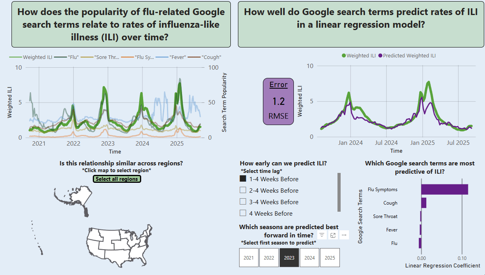

# Predict the rate of influenza using Google Trends

## Introduction
This project explores whether search trends related to influenza symptoms can help predict rates of influenza infection in the United States.
The dashboard integrates CDC FluView surveillance data (ILI/WILI rates) with Google Trends data for flu-related search terms across HHS regions and seasons.

The goal is to visualize and model how public search behavior aligns with — or potentially anticipates — official surveillance signals of flu activity.

**Download the *dashboard.pbix* file and open with Power BI Desktop to explore this dashboard!** 

## Analysis
The dashboard features the weighted influenza-like illness rates 
- **Search term popularity mirrors influenza activity**: Changes in popularity of each flu-related Google Search term track with rates of influenza-like illness across flu seasons. Notice that during the 2020-21 season influenza was almost non-existant, and continued to be lower in the following 2021-22 season. Interestingly, the search term "flu" peaked similarly in these two seasons compared to later seasons, suggesting its popularity is driven more by seasonality than by flu activity. The search term "flu symptoms" tracks most consistently with season-to-season variability in influenza activity, having near-zero popularity in the 2020-21 season and closely following WILI trajectories thereafter.

-  **Regional patterns in search term popularity reflect local flu dynamics**: Using the interactive map to slice by region shows that relationships between search term popularity and flu activity are fairly consistant across the U.S., varying in magnitude and timing with each regions influenza trajectory.

-  **Predicting WILI using search term popularity**: A regression model was trained to predict weekly weighted influenza-like illness (WILI) rates based on search term popularity (time of year was not a feature). The model captures how public interest in flu-related topics can serve as a leading indicator of flu activity.
  -  **Recent search trends are stronger predictors of flu activity**: Models using more recent search term data—particularly within 1–3 weeks before the target week—consistently achieved higher predictive accuracy than those using longer lead times. This suggests that current search activity closely reflects real-time community symptom levels and healthcare engagement.
  -  **Predictions become markedly better when training on at least two previous seasons**: Incorporating data from two prior flu seasons (e.g., predicting the 2022 season and beyond using the 2020 and 2021 seasons as training data) improves model accuracy. This likely reflects the benefit of having more varied examples of how search-term popularity aligns with influenza activity. However, the 2020 season was an anomaly with near-zero flu activity during COVID-19. It’s possible that one typical season of training data is sufficient, but including the 2020 season may add noise rather than improve accuracy.
  -  **Search popularity of "flu symptoms" is the strongest predictor of flu activity**: Among tested search terms, “flu symptoms” shows the highest association with influenza activity, suggesting it reflects actual illness rather than general seasonal awareness.

## Conclusion
Google search trends, particularly for “flu symptoms,” closely align with official influenza surveillance data. This supports the potential of search behavior as an early signal for monitoring and predicting flu activity.

## Limitations and Future Iterations
-  **Predicting the peaks**: The model performs best during periods of gradual change—both leading up to and following each season’s peak—while losing accuracy at the height of flu activity. Accurately predicting the timing and magnitude of seasonal peaks would be highly valuable to both healthcare providers and businesses, given the operational and behavioral impacts of peak flu periods. Future iterations will test whether additional feature engineering or more complex machine learning approaches can improve peak detection and forecasting.

-  **Selecting training and testing data**: The current version of the dashboard only supports predicting forward in time—using all available prior seasons as training data to forecast subsequent seasons. Future versions will allow users to manually select specific seasons for both training and testing. This will enable experimentation to identify which seasons best predict one another, explore cross-season relationships, and test the stability of relationships under different historical conditions. 

-  **Fixing Google Trends web scraping**: Although the infrastructure for automated weekly updates to Google Trends data is already in place, Google has temporarily flagged the current IP and blocked PyTrends requests. I plan to review Google’s usage policies more closely and adjust request throttling to ensure compliance and uninterrupted updates.

## Technology Used
- **Python**: Data ingestion, transformation, API development, linear regression model

-  **Flask**: Backend REST API to serve cleaned and merged data

-  **Google BigQuery**: Centralized data warehouse for all raw and processed datasets

-  **Google Cloud Run**: Hosting the Flask API as a serverless application

-  **Google Cloud Scheduler**: Automates weekly updates of FluView and Google Trends data

-  **Power BI**: Interactive dashboard for time-series visualization and regional comparisons

## Data Sources
- **CDC FluView API**
  - Weekly influenza-like illness (ILI) by region and season
  - https://www.cdc.gov/flu/weekly/fluviewinteractive.htm
- **Google Trends (via Pytrends)**
  - Weekly search interest for influenza-related terms
  - Pytrends is a Python library that serves as an unofficial API for Google Trends, allowing automated retrieval of serach interest data directly from Google. It simulates user intereactions with the Google Trends web interface, enabling queries for specific keywords, time ranges, and regions, and returns normalized serach-volumne data (https://pypi.org/project/pytrends/).